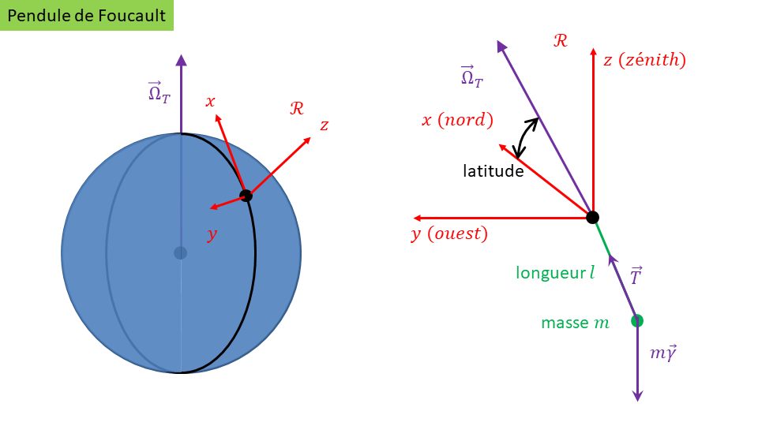
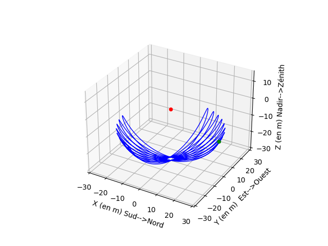
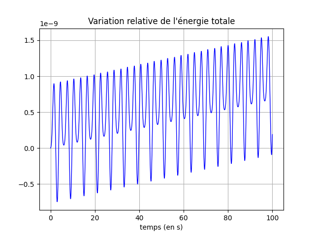
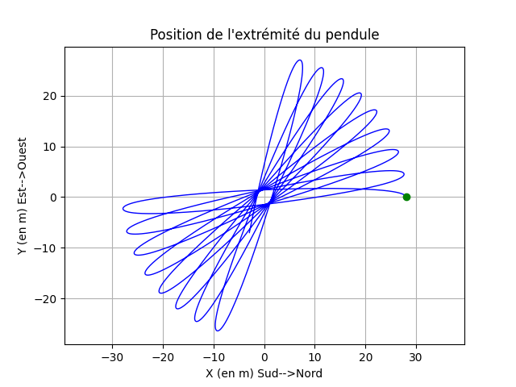
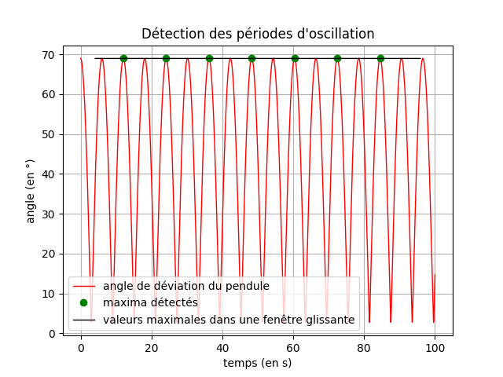
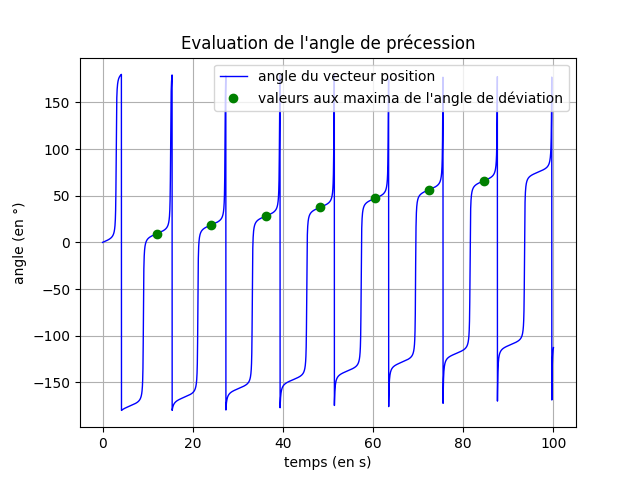
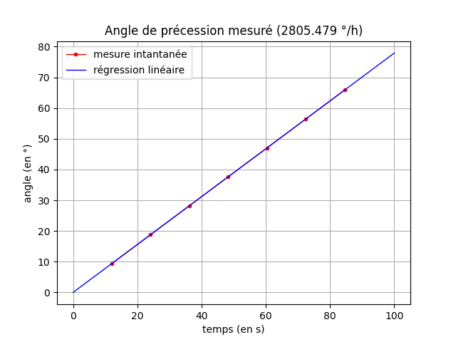
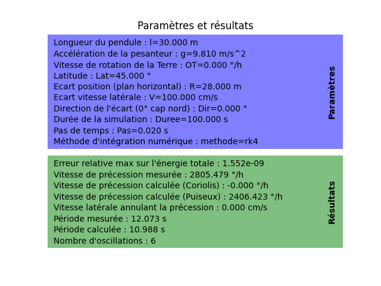

# Pendule de Foucault

## Quoi de neuf ?

L'expérience de Foucault est déjà ancienne et les modélisations diverses ont donné accès aux moyens de calculer littéralement la vitesse de précession du plan d'oscillation du pendule en fonction de la latitude.

L'idée ici est d'accéder à une équation d'état qui ne fasse pas appel aux approximations habituelles (voir le [détail des calculs](Data/miseenequation.pdf) et la description qui suit), de sorte que l'on puisse notamment mettre en évidence par simulation numérique un [effet parasite](https://fr.wikipedia.org/wiki/Pendule_de_Foucault) mis en évidence par [Victor Puiseux](https://fr.wikipedia.org/wiki/Victor_Puiseux).

En rapport avec la modélisation proposée ici, cet effet induit une vitesse de précession $\omega_{puiseux}$ du plan d'oscillation du pendule qui s'exprime approximativement en fonction des paramètres ci-dessous.

- $l$ : longueur du pendule en m
- $R$ : écart dans le plan horizontal par rapport à la verticale en m
- $V$ : vitesse initiale latérale en m/s

$$\omega_{puiseux} \approx \dfrac{3RV}{8l^2}$$

Avec la modélisation proposée, on pourra évaluer quantitativement la vitesse latérale $V$ qui viendrait par exemple annuler la précession à laquelle on s'attend avec la force de Coriolis. Cette vitesse, éventuellement très faible, met l'accent sur le fait qu'il faut une vitesse initiale rigoureuement nulle - avec les précautions expérimentales associées - pour accéder aux résultats classiques de cette expérience.

## Description

### Les notations

On note $\vec{p}$ la position de la masse $m$ suspendue à un fil de longueur $l$, $\vec{v}$ sa vitesse et $\vec{a}$ son accélération, définis dans un repère orthonormé

$$
\begin{pmatrix}\vec{u}_x&\vec{u}_y&\vec{u}_z\end{pmatrix}
$$

Le vecteur $\vec{u}_z$ pointe vers le zénith, $\vec{u}_x$ vers le nord et $\vec{u}_y$ vers l'ouest.



### Principe fondamental de la dynamique

Bilan des forces, avec la tension $\vec{T}$ du fil, colinéaire à ce fil :

$$
\vec{T}+m\vec{\gamma}=m\vec{a}
$$

Prise en compte de la pesanteur avec $g=9,81 m/s^2$ (accélération due à la gravitation et à la force d’inertie centrifuge) et de l'accélération due à force de Coriolis.

$$
\vec{\gamma}=\left(\begin{matrix}\gamma_x\\\gamma_y\\\gamma_z\end{matrix}\right)=\left(\begin{matrix}0\\0\\-g\end{matrix}\right)-2\vec{\Omega}_T\wedge\vec{v}
$$

### Equation dynamique

Au final, on détermine complètement le mouvement avec les coordonnées $x$ et $y$ de la masse suspendue. La coordonnée $z$ et sa dérivée première $\dot{z}$ sont implicitement connues. On a $z=-\sqrt{l^2-x^2-y^2}$, puis $\dot{z}=-\frac{x\dot{x}+y\dot{y}}{z}$, et enfin $v^2=\dot{x}^2+\dot{y}^2+\dot{z}^2$.

L'équation dynamique avec l'état

$$
\begin{pmatrix}x\\y\\\dot{x}\\\dot{y}\end{pmatrix}
$$

est alors :

$$
l^2\ddot{x}=-xy\gamma_y-xz\gamma_z+(l^2-x^2)\gamma_x-xv^2
$$

$$
l^2\ddot{y}=-yx\gamma_x-yz\gamma_z+(l^2-y^2)\gamma_y-yv^2
$$

## Le notebook

Un [notebook](Notebook/Pendule_de_Foucault.ipynb) est disponible et illustre les résultats de simulation avec différentes conditions initiales.

## Le code

Un [programme Python](Code/pf.py) est disponible et permet de lancer différentes simulations.

```python
>>> import pf
>>> pf.pf_sim(l=30, g=9.81, OT=0, Lat=45,R=28, V=1, Dir=0,Duree=100, Pas=0.02, methode='rk4')
début de la simulation numérique
fin de la simulation à 0:00:00.815646 (hh:mm:ss.ms)
```








